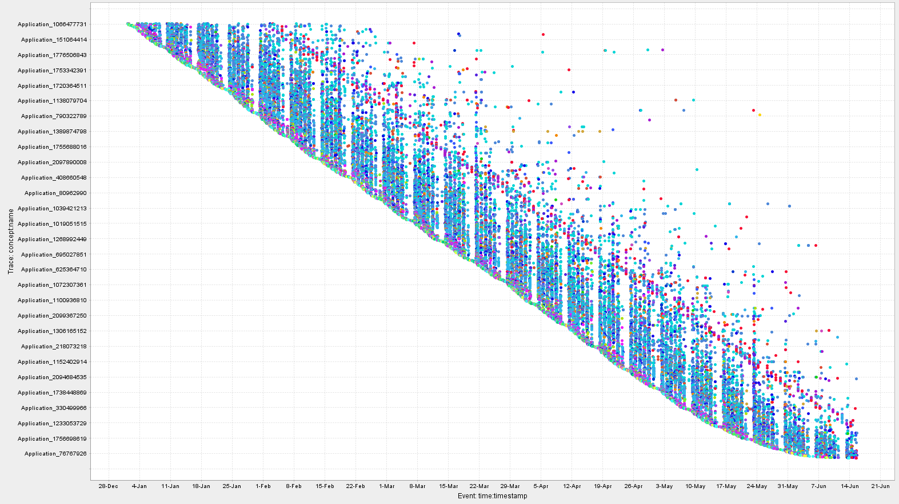
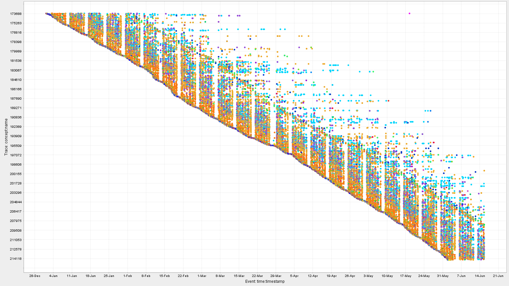
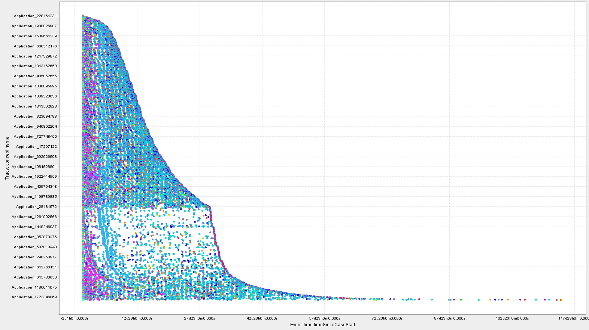
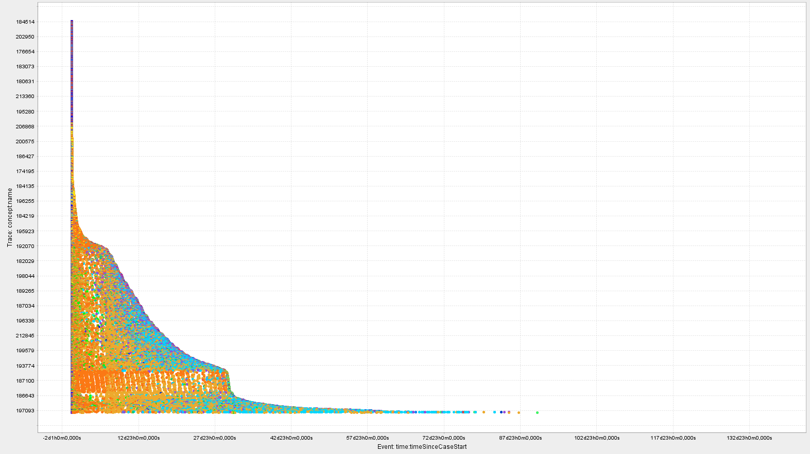
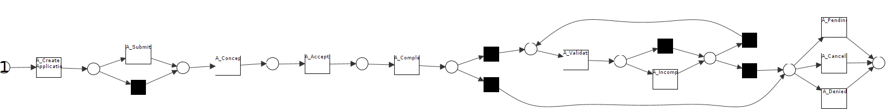
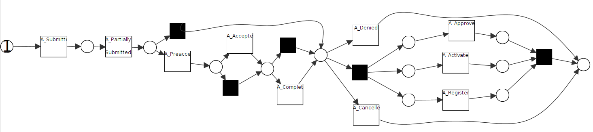
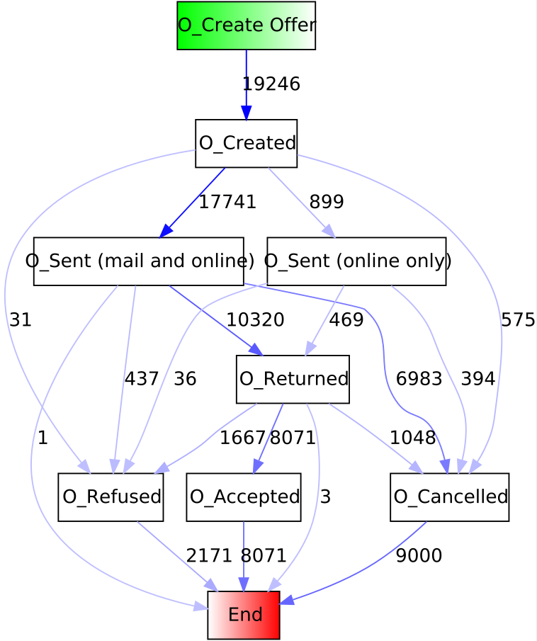
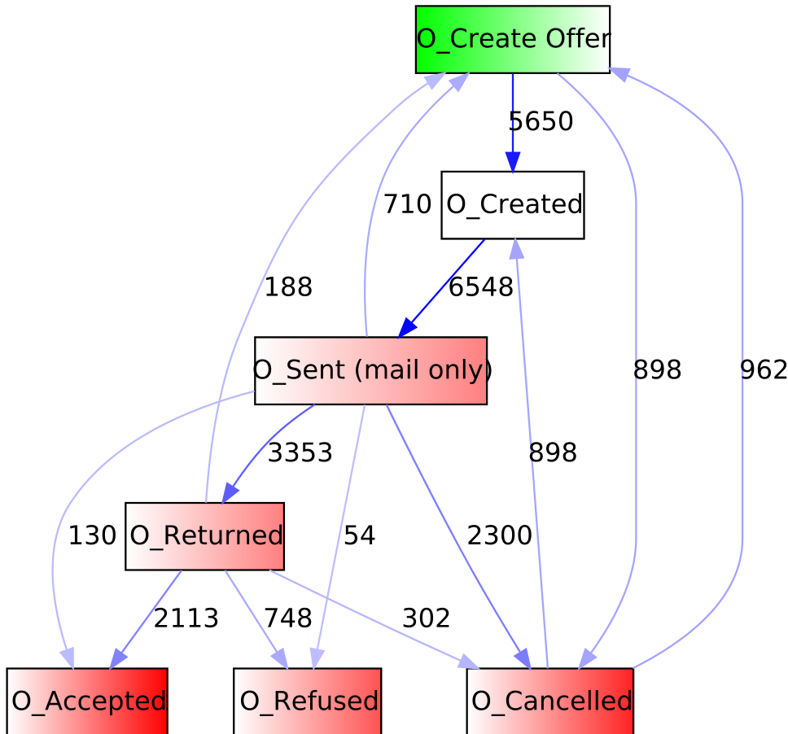
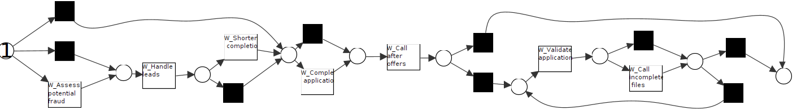
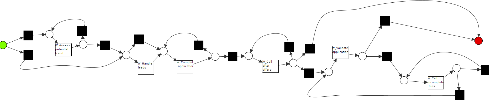

# Report 

## Introduction

In this report, we analyze your loan application process and provide various insights into the process. We present numerical data, different models, and deviations discovered during the analysis. 

The report distinguishes between two branches:
- **Branch 1**: Allows both online and in-bank applications for a loan and uses a different information system.
- **Branch 2**: Does not support online applications and has fewer event attributes.

Despite these differences, the two branches share several similarities, which are thoroughly examined in this report.

# Preliminary Analysis

In this section, we are going to analyze two different branches used by a bank for their loan application process and state the key differences one can obtain by looking at statistics. The process usually starts and should start with an application by the customer and end with a response from the bank. Most often, we see that applications get sent in, accepted, and then the offer is prepared, and the customer is notified about the success. The process ends with activities regarding the workflow, but also with possible cancellations and calls after the offer.

## Overview of Basic Statistics

Both branches seem to have similar amounts of applications, which can be seen as the amount of traces in the first log is **14159** and **13087** in the second log. There are **7697** trace variants in the first log and **4366** in the second log. This might be explained due to the first log having **527123** events and the second one only **262200**. Therefore, looking at the amount of events, the second log has fewer possibilities to be diverse. Further, more events happening might explain why the average length of a trace in the first log is **37.229** and therefore higher than the average of **20.035** observed in the second log. Being more active, the first branch has **124** resources working while the second branch has only **68** resources, excluding "nan" (at this point it is not clear what "nan" could mean and since it is not asked for the task at hand, we do not elaborate it further). Looking at the longest work both branches had for a process, we observe a duration of approx. **115** days for the first log and **137** for the second log. Contrary, examining the shortest duration of a trace, we see that the first branch took **282** seconds for its shortest traces and only **2** seconds lasts the shortest trace in the second log. The average case duration is **21.51** days together with a median of **7.28** days for the first branch and an average of **8.62** days and a median of **0.81** days for the second branch. Both logs start on 01/01/2022 and end on 06/15/2022. Looking at the activities that happen only on one branch and not on the other, we have that *A_Validating*, *O_Sent (online only)*, *A_Pending*, *W_Shortened completion*, *A_Concept*, *A_Create Application*, *O_Sent (mail and online)*, and *A_Incomplete* occur only in branch one, and *A_Approved*, *A_Preaccepted*, *O_Sent (mail only)*, *A_Activated*, *A_Partially Submitted*, *A_Registered*, and *W_Modify contract details* occur only in the second branch. However, without knowing how the process on each branch works exactly, the names might not have the same meaning if they sound similar (and vice versa).

## Dotted Charts for Logs L1 and L2

In the following figure, we can see the four dotted charts.
{#loan-process-chart}
|  |  |
|-------------------------------------------------------------|-------------------------------------------------------------|
| Cases over event timestamp in L1                           | Cases over event timestamp in L2                           |

|  |  |
|---------------------------------------------------------------------|---------------------------------------------------------------------|
| Cases over time since case start in L1                             | Cases over time since case start in L2                             |

### Cases over the event timestamp

In both charts, we can see a structured layout, where we observe column-wise behavior over time representing each week. Also, this structured layout might be explained due to strict time slots reserved for certain activities. On Sundays there are usually only a few activities (acceptances, completions, validations, rejections etc.) which *could* be system generated. Both branches allow for a continuous start of an application, which is seen by the bottom linear slope of the chart where the first branch has a higher case arrival rate than branch two (but the case arrival rate for the first branch becomes less towards the end). Moreover, the first branch has a much "denser" slope of events, which might be explained due to it having more possibilities to apply for a loan than the second branch. Further, we can observe daily batching in the first branch every day at 9 PM for the first half of the timeline and then shifting to 10 AM for the second half on the activities for canceling and calling after offers. In the second log, we observe only a little bit of batching, happening at 10 AM in the first half and then at 11:15 AM in the second half and batching the same events as branch one. Looking at the weekdays everything, especially regarding the workflow, can happen in any order in both branches. Lastly, we discover a second slope (red in branch one and slightly orange in branch two) "above" most activities and parallel to the first slope mentioned above. This slope represents the end of most of the processes and indicates that most traces usually have the same duration on their branch, except some outliers, which can be seen as the seemingly randomized dots in the right upper part of each chart (mostly W_Call incomplete files).

### Cases over time since case start

Changing the time interpretation yields the two bottom subfigures of the previous figure. The first observation is the spike in the chart for the second branch, which describes that on this branch roughly half of the traces are stopped almost immediately (might be a result of the automated assessment, which is either more strict or simply shorter on branch two). This is supported by the low median found in subtask a. This constitutes a big difference between the two branches and could be considered noise. Therefore, filtering it out and scaling the chart up, we end up with a quite similar chart as for the first branch. One additional observation is the white space towards the bottom of both charts, where the applications start and then not much happens and then the process ends after roughly 30 days. This could imply a cluster of customers, where many customers apply, and then do not interact with the process anymore and then get reminded by the system (blue vertical line in chart c) and then after no response the process gets canceled by the system automatically. This can be also seen in the chart for L2, however here we observe more W_Complete application and more offers after hours, which could imply that this is a cluster of people negotiating more and that this might be more frequent on branch two. Hence, we observe a visual similarity with two different meanings. The described cluster of customers for chart c can be seen in chart d towards the bottom.

## Filtering Strategy for Complete Cases

We have three sublogs, which is why we look at all their abstract processes and try to find necessary activities. Looking at the application part of a log, we see that, by the description of the process, *A_Concept* represents the start of an application and *A_Pending*, *A_Denied* and *A_Canceled* represent the end of an application process, hence these are mandatory for any trace. The last two also allow for termination of a trace.

Looking at the offer DFG, we see that offers usually end with *O_Refuse*, *O_Accept* or *O_Cancel*. This, however, is tied to the condition that an offer has been created before. Therefore, our filtering strategy regarding the offer part is that creating an offer appears if and only if the offer is either accepted, canceled, or refused.

Examining the workflow DFG (after filtering out some noise), we see that *W_Complete application* is part of every workflow. The workflow is terminated if and only if *W_Complete application* appears in the trace.

### Current end activities in each branch

**Log1:**

- W_Validate application
- W_Call incomplete files
- O_Cancelled
- W_Call after offers
- W_Complete application
- W_Assess potential fraud
- W_Shortened completion

**Log2:**

- W_Validate application
- W_Modify contract details
- A_Denied
- W_Complete application
- A_Cancelled
- W_Call incomplete files
- W_Handle leads
- W_Call after offers
- W_Assess potential fraud
- O_Cancelled
- A_Registered

# Preprocessing

Before discovering the process one might filter the event data and filter out everything that does not appear too often, since this would be regarded noise and might defer the impression of the actual process. One example for this might be the short traces on the second branch (see [here]((#loan-process-chart))). In addition, we could shorten processes that need much longer to complete than the average, since they could be considered outliers. In this log in particular three types of events exist (W, O, A). Therefore we split the log into three parts as well. We apply these preprocessing strategies.

# Process Discovery

In the following, we discover models for the three stages of the process and the two logs. We start by looking at the application process.

## Process of Application States

We first mine the log of the first branch. Starting with the Alpha Miner we do not end up with a workflow net and thus this miner is not applicable for us. The heuristics miner together with a frequency threshold of **0.1** yields a quite large and not simple model, which is why we omit it. Further, using a threshold of **0.3** gives us a too overfitting model. The inductive miner without any parameters gives a good model in terms of replaying the log but is worse than the inductive miner with a noise threshold of **0.1-0.2**. The IMf gives us a simple log which has good fitness, is not overfitting, and represents the process the best. Further, we ran the ILP Miner but ended up with a model, having many arcs and not good precision and fitness after analyzing with ProM. Lastly, we tried the eST Miner but it could not finish computing.

*Figure 1: $M_{1}^{A}$ mined with IMf and a noise threshold of 0.2*

We go the same way as before and first run the Alpha Miner on the filtered log for branch two. This gives us a workflow net this time, but it is not sound, contains too many implicit places, and is not simple. Speaking of simplicity, we again have that the ILP miner is not simple and therefore not further contemplated. The IMf with frequency thresholds of **0.1-0.2** is precise but too general, which is why we recommend the normal IM (see *Figure 2*). The Heuristic Miner would also be a good choice, because of its statistics. It has a fitness of **0.99** and a precision of one but is not as simple as the Inductive Miner, who has a fitness of **1**, by construction, but a precision of **0.956**. For reasons of simplicity we choose the Inductive Miner in its classical variant. Again, the eST Miner could not finish computing.

*Figure 2: $M_{2}^{A}$ mined with IM*

Comparing the two models, we see that they look similar by their structure. The first model starts with creating an application and then choosing between submitting or directly moving towards A_Concept. This is not observed in the second model, which is due to the fact that submission is only possible via an online application. Confusingly, the second branch has also a submitted state, which is why we cannot rely on names when analyzing (see enhancement strategies). Now the "low" precision of $M_{2}^{A}$ comes to shine when we observe that multiple activities can be skipped by tau transitions. This is not highly observed in the first model, where we only have a few decisions, and applications are always first accepted and completed (which can be skipped in the first model). The second model has a pre-accepting state, which cannot be seen in the first model. This might be a result of the difference in the information systems. Towards the end $M_{1}^{A}$ allows for looping between validation and marking incomplete files, which cannot be seen in the second model (according to the model the second branch has to have complete files at some point in time). At the end we can choose between denying and canceling and the state A_Pending in the first model. The difference to the second model is here that branch two allows for a parallel run between A_Approved, A_Activated, and A_Registered.

## Process of Offer States

As requested, we do not filter the offer logs. The directly follows graphs (abbrev. DFG) can be looked at below.

*Figure 3: DFG LO1*

*Figure 4: DFG LO2*

The main difference is that the DFG for the first log has an end activity which cannot be seen in the second log. Further, the DFG for the first log has no loops and therefore does not allow for repetitions in an offer process. The other DFG allows for the creation of multiple offers after an offer has been canceled, which could be the result of negotiations, allowed by the second branch. Hence, acceptance and refusing could be considered the two end activities for an offer process on the second branch, but *not quite*. Looking at the colors, we observe that the first branch ends always in end but in the second branch some offer processes end in O_Sent (mail only) and O_Returned, representing incomplete processes. For completeness, we should consider the first DFG, nevertheless, the second DFG represents realistic behavior, with customers simply not responding and rejecting offers. For *analyzing* the process, we choose the second DFG (because we can analyze where the problems exactly lie to enhance the process) but for a desirable behavior and a *discovery* we would like to see the first DFG, since it avoids loops and has individual start and end activities. The reasons for the differences could be that the first branch has better tracking of the process. This is supported by the fact that the first branch offers one additional technology and therefore might also have better technology in general when it comes to control of the workflow.

## Process of Workflow States

Lastly, we analyze the workflow of the process. To do so, we mine the two models $M_{1}^{W}$ and $M_{2}^{W}$ with the IMflc Miner, using a noise threshold of **0.05** for the first model and a threshold of **0.2** for the second one. We omit the IMlc Miner since it yields too large and not simple models.

*Figure 5: $M_{1}^{W}$ mined with IMflc and a noise threshold of 0.05*

*Figure 6: $M_{2}^{W}$ mined with IMflc and a noise threshold of 0.2*

Comparing the two models we can see that both allow for many choices. Still, the second model required for a complete application whereas this step can be skipped in the first log, but both require a call after offers. A call after offers can be looped in the second model, which is realistic. The end part for both workflows is the same as both models either finish with call after offers or go for validating the application and possibly calling and looping for incomplete files. The first branch has fewer choices than the second one and follows therefore a stricter order, which has been already mentioned throughout the course of this report. The fact that the second model has more loops shows a general trend, as loops were also seen in the DFG for the second log in the offer state.

### Description of $M^W_1$

It is possible to skip the first three activities. The first step is to either assess for potential fraud or to skip this step. Next, the leads are being handled and this is either followed by a shortened completion or by skipping the shortened completion. After that, it is possible to complete the application or to skip this step. Then it is always mandatory to make a call after the offer. The process can then be finished or the validation of the application takes place. After validating a call for incomplete files can be made. After that, the validation process including the option to call for incomplete files can be repeated multiple times before finally reaching the end.

### Comparison and Description of $M^W_2$

The Petri net starts by either checking at least once for potential fraud or by skipping this step. After that, it is possible to handle the leads or skip this step. The difference to the first model is that there is no longer an option for shortened completion. Now there are three options, one of which is to end the process. Another option is to validate the application. After that, it is always called at least once for incomplete files before ending the process. The third option is to complete the application at least once and then finish the process or to call the customer after the offer at least once before finally finishing the process.

Compared to the previous model, there are some differences. It is not mandatory anymore to call after an offer. It is not possible to call after an offer without completing the application first. Also, it is not possible to redo the validation but only the call for incomplete files.

